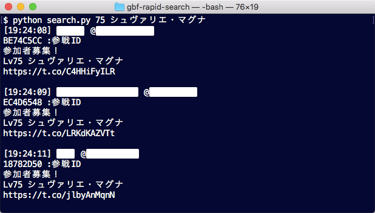
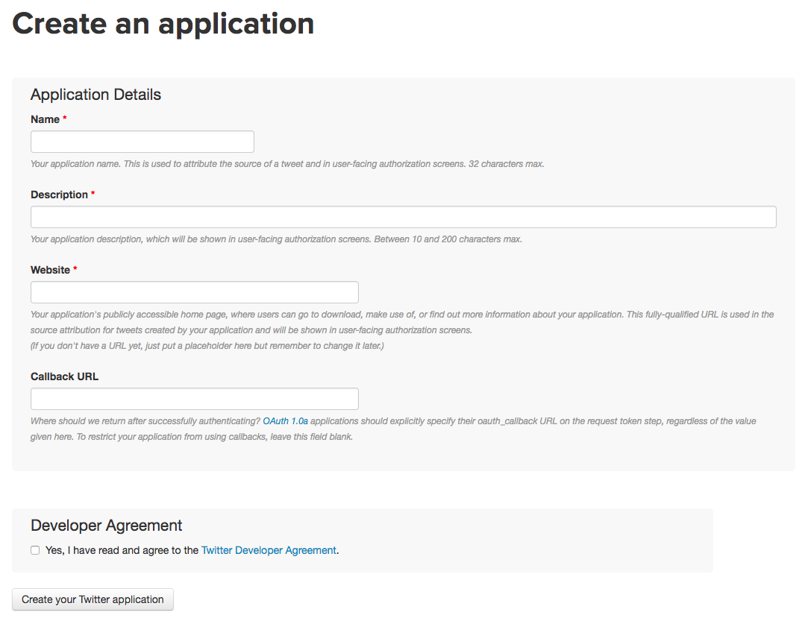
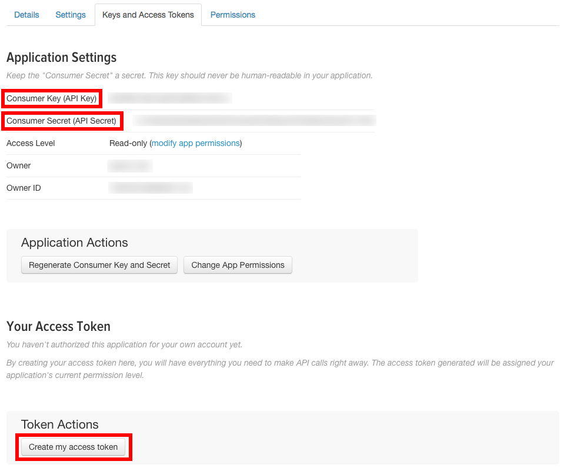
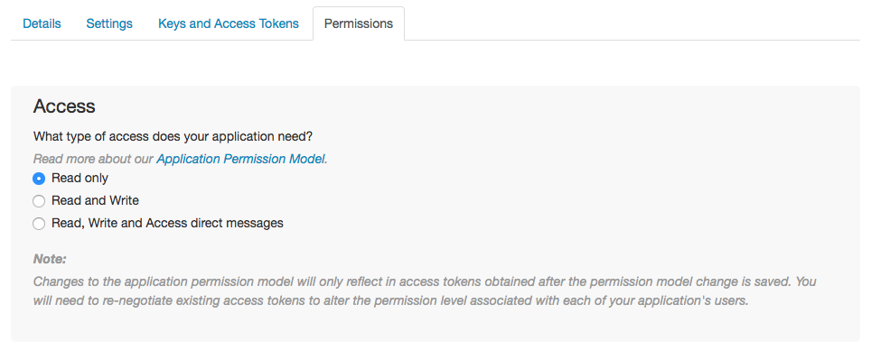

 

# グラブルTwitter救援検索ツール on Command Line

コマンドラインで動くグラブルTwitter救援検索ツール．

## 概要  
指定したマルチバトルの救援依頼ツイートを取得し，参戦IDを自動でクリップボードにコピーします．  
IDをコピーするためのクリック動作が不要なため，同種の<strong>Webアプリよりクリック1回分早い</strong>です．

## 必要なもの
+ Python3.x

## 準備

### Consumer Keyの取得
1. Twitterにログイン後，https://apps.twitter.com にアクセスして「Create New App」をクリック．
  

2. 下のような画面が出てくるので，入力して「Create your Twitter application」をクリック．


   + Name  
   何でも構いませんが，他のアプリケーションと重複しないようにする必要があります．

   + Description  
   認証画面で出てくる説明文．本ツールは認証画面を持たないので適当で大丈夫です．
   
   + Website  
   本ツールはWebアプリではないので適当に．

   + Callback URL  
   空白で大丈夫です．  

3. 「Keys and Access Tokens」タブより「Consumer Key」「Consumer Secret」を取得．さらに「Create my access token」をクリックすると「Access Token」「Access Token Secret」を取得できる．  

これら4つのパラメータを`search.py`内の`consumer_key`以下4つのプレースホルダーと入れ替える．  

+ Permissionについて  
ツイートを取得するだけなのでRead onlyで構いません．


### ライブラリのインストール
```
pip install requests_oauthlib
```

## 使用方法

```
python search.py level name
```
### 例

```
python search.py 75 シュヴァリエ・マグナ
```
+ 取得したツイートがコマンドラインに表示され，同時に参戦IDがクリップボードにコピーされます．
+ 終了するときは`Ctrl+C`を押してください．

## その他
+ 日本語のみの対応です．
+ 2018年6月20日にUser StreamsなどいくつかのAPIを廃止するという[アナウンス](https://blog.twitter.com/developer/ja_jp/topics/tools/2017/aaa.html)がありましたが，本ツールが使用しているPublic Streamsは存続すると思われます．